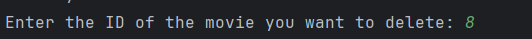

# MovieConsoleApp
Java winter semester credit program.<br>
The Movie Application Manager that is supposted to manage user's movies. 


## Features
A classic console application for managing movies you watched or always wanted to watch, collecting statistics from your movie path and storing all data in application with easy interface.

## Installation
To start the program, follow the steps below:

 1. Clone the repository in terminal using next command:<br>
    ```git clone https://github.com/Eramcheg/MovieConsoleApp.git```
 2. Navigate to the directory with cloned reposity:<br>
    ```cd MovieConsoleApp```
 3. Compile the code with maven:<br>
    ```mvn clean compile```
 4. Run the code with maven:<br>
    ```mvn exec:java```

## Usage

### 1. **Welcome Menu**<br>
   When the user launches the application, the first screen they encounter is the Welcome Menu. This menu serves as the gateway to the application, offering two primary functions:
   - **Start Application**: This option allows the user to enter the main interface of the application where they can manage and interact with their movies.
   - **Quit**: This option provides a way for users to exit the application if it was opened accidently.
     <br>
 

### 2. **Main Menu**<br>
Once inside the application, users are presented with the Main Menu, which serves as the central hub for all primary interactions. From here, users can manage their movie collection with the following options:<br>


#### 2.1. Add a new movie <br>
This option allows users to input and save new movie details into their collection, expanding their movie database.
When user chooses this option, app starts process of adding new movie by requesting appropriate data:<br>

<a name="movies_rules"></a>
##### **Rules of movies details**<br>
- **Movie Title**: First it asks for Movie Title (That can be in any form), or user can type 'quit' to stop process of adding. It requests 'quit' with a small first letter to avoid situations when movie 
has exact same name. It user wants to add "quit" as a movie title, it has to start with a capital letter - "Quit".<br>
- **Director**: Second value - is a director of a movie, also can be written in any form (Quentin Tarantino, Tarantino, Quentin). But user has to be aware of misspelling, because system recognise 
Quentin Tarantino and Tarantino as different directors when generates movies statistics.<br>
- **Main Genre**: Third value - main movie genre. It can be written in any way (Action, War, Scifi, Science Fiction, etc.). But user has to be aware of misspelling.<br>
- **Release Year**: Fourth value - movie release year. It can be written only in digital format (2021, 2004, 1994). But user can't write year of movie that is less than release year of first movie ever 
(Officially first movie was "Roundhay Garden Scene" in 1888, [source](https://en.wikipedia.org/wiki/Roundhay_Garden_Scene#:~:text=Roundhay%20Garden%20Scene%20is%20a,Kingdom%20on%2016%20November%201888.)) <br>
- **User's Movie Status**: Choose the status of the movie from the following options:<br>
       1. Want to watch<br>
       2. Watching<br>
       3. Already watched<br>  
  Enter the number corresponding to the desired status.<br>
- **User's Rating**: Sixth value will be requested in the situation if user's movie status was 3. Already watched. This values asks for user's rating of the watched film. This value can be written only 
in the forms 3 (Integer value), 9.4 (Decimal with dot) or 9,4 (Decimal with comma). <br>
          
#### 2.2. Display all movies
This option dispays to user all his current movies in the user's list and opens Movies menu to manage existing movies and movies display. For more details click [here](movies)<br>
 
#### 2.3. Display statistics
This option opens Statistics menu to calculate and show statistics about existing user's movies. For more details click [here](statistics)<br>

#### 2.4. Exit
This option exit the program. <br>

<a name="movies"></a>
### 3. **Movies Menu**<br>
Once user chooses "Display all movies" option on main menu, it displays all user's movies and menu to manage these movies. In the menu user can do next: 


#### 3.1. Edit movie
This option allows users to edit and save movie details.
When user chooses this option, app starts process of editing the movie by requesting appropriate data:<br>
- **Detail to edit**: Firstly it asks user for the detail to edit:<br>
        1. Title <br>
        2. Director <br>
        3. Genre <br>
        4. Year <br>
        5. Status <br>
        6. Rating (Only if status is Already watched)<br>
- **New detail value**: Then it asks for new detail value based on the rules, described [here](#movies_rules). <br>
**Important!** If user decided to change status to Already watched, then system will ask user for rating of that movie.
 
#### 3.2. Filter movies displaying
This option allows users to filter displaying movies.
When user chooses this option, app starts process of applying filter by requesting appropriate data:<br>
- **Field to filter**: Firstly it asks user for the filtering field:<br>
        1. Title <br>
        2. Director <br>
        3. Genre <br>
        4. Year <br>
        5. Status <br>
        6. Rating <br>
- **For text data**: System will ask for text based filter value (Title, Director, Genre)
- **For Year and Rating**: System will ask for range (Year From and Year to) to show movies within this range.
- **For statuses**: System will ask user for specific status to show movies with this status. <br>

#### 3.3. Order movies displaying
This option allows users to order displaying movies.
When user chooses this option, app starts process of applying order by requesting appropriate data:<br>
- **Field to order**: Firstly it asks user for the ordering field:<br>
         1. Title <br>
         2. Director <br>
         3. Genre <br>
         4. Year <br>
         5. Status <br>
         6. Rating <br>
- **Order type**: System asks user for sort order: <br>
         1. Ascending (From the lowest to greates) <br>
         2. Descending (From the greatest to lowest)<br>
  
#### 3.4. Set display type
This option allows users to use different type of displaying movies.
When user chooses this option, app asks user to choose displaying type:<br>
  1. **Detailed list format** Example: <br>
     <br>
  2. **Compact paragraph format** Example: <br>
      <br>
     
#### 3.5. Delete movie
This option allows users to delete movies by it's ID (Provided in the display).
When user chooses this option, app asks user to choose movie ID. Example: <br>
- **Id location**:<br>
<br>
- **Delete example**:<br>
<br>

#### 3.6. Back to main menu <br>
This option returns user to main menu.


<a name="statistics"></a>
### 4. **Statistics Menu**<br>
Once user chooses "Display statistics" option on main menu, it displays menu of statistics options user can found about movie list. In the menu user can see next statistics: <br>


#### 4.1. Total statistics
This option shows users total statistics about movie collection. Total statistics includes:<br>
     1. **Total movies added to the collection**<br>
     2. **Oldest movie from the collection**<br>
     3. **Newest movie from the collection**<br>
     4. **The director from which the user has the most added movies**<br>
     5. **Highest rated movie**<br>
     6. **Lowest rated movie** <br>
     7. **All genres from collection user covered**<br>
#### 4.2. Movies by genres
This option shows user's statistics about genres covered in the movies collection in the form of horizontal bar chart, where on the left there are genres, and on the right(top of each bar) total number of movies of this genre. Example: <br>


#### 4.3. Rating statistics
This option shows user's statistics about user's rating in the movies collection in the form of horizontal bar chart, where on the left there are rating ranges (0-1, 1-2, 2-3 ... 8-9, 9-10), and on the right(top of each bar) total number of movies of this rating range. Example: <br>


#### 4.4. Movies by directors
This option shows user's statistics about directors covered in the movies collection in the form of horizontal bar chart, where on the left there are directors, and on the right(top of each bar) total number of movies of this director. Example: <br>

<br>

#### 4.5. Back to main menu <br>
This option returns user to main menu.

## Contributing
This project is for educational purposes.

## Authors
This project was developed by Salohub Illia, student of Charles University in Prague.

## License
This project is licensed under the [MIT License](https://opensource.org/license/MIT/).

## Acknowledgment
This project was developed as part of the Programming in Java Language[NPRG013]course. Special thanks to the course instructors.
